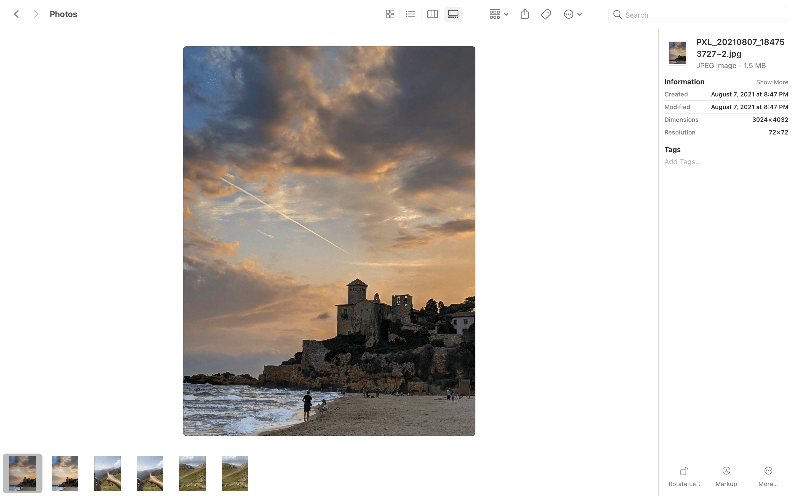
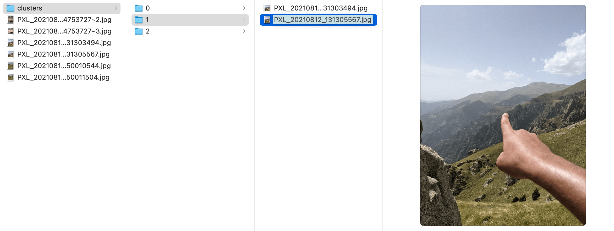

<h1 align="center"> Image Cleaner
  🏞🏞 ➡ 🏞 </h1>

This tool can take your image gallery and create a new folder with image-alike-cluster folders. It uses a perceptual image hashing algorithm and a custom threshold to cluster them. An improvement could be to add deep-learning to the scene and cluster the images based on features. To cluster the images efficently, it uses a BK-trees since checking duplicates can turn into a O(N^2) problem pretty easily.

<div align="center">
  <h3>
      Before
  </h3>
  <br>

  <br>
  <h3>
    After
  </h3>
  <br>

</div>


Image Cleaner was created upon a friend request. After a friends-trip, he had several pictures that looked alike (from different smartphones) and he wanted to select the best ones. He tried to use [fdupes](https://github.com/adrianlopezroche/fdupes) to start removing the exact duplicates but it didn't even work since some of the images were sent using Google Photos, Whatsapp, etc (different compression algorithms and sizes). After a quick search I found some python examples like: [duplicate images](https://github.com/philipbl/duplicate-images) or [Fast Near Duplicate image search](https://github.com/umbertogriffo/fast-near-duplicate-image-search) but I did not find anything similar written in Go so here it is. 


> As a note, this is my first piece of code written in Go so it probably won't be as good as I'd like to. Any comment or improvement will be gladly received :D

## Installation

To start using Image Cleaner, install Go and run ``go get``:

```shell
go get -u github.com/adriacabeza/go-imagecleaner
```

This will retrieve the library.

Moreover, if you prefer it, you can use the [binary released version](https://github.com/adriacabeza/go-imagecleaner/releases/tag/v0.1-alpha).


## Usage

```shell
imagecleaner -imagesPath=IMAGE_PATH -threshold=THRESHOLD
```
If you do not specify any value for *threshold* it will use its default value = 10. 

This will create a folder called **clusters** with each image structured into cluster folders. **Note that the code only copies images, it does not remove them.**

**Example**:

```shell
$ go run main.go ./cluster_utils.go ./image_utils.go -imagesPath=/Users/adria/Downloads/Photos
Starting to cluster your images from /Users/adria/Downloads/Photos
Selected 6 images
 6 / 6 [=================================================================================] 100.00% 2s
Images hashed and BK-tree created
Creating clusters
 6 / 6 [=================================================================================] 100.00% 1s
Found 3 clusters in 6 images
Clusters created
 3 / 3 [=================================================================================] 100.00% 0s
Done
```

> note that all the clusters that are size 1 (just one image) are merged into a big folder of unique images


## TODO

- [ ] Try another hash functions
- [ ] Add some testing
- [ ] Create binary


### Credits

- [Duplicate image detection](https://benhoyt.com/writings/duplicate-image-detection/): the idea of this module is mainly based on this very cool blogpost.
- [Go image Hash Library](https://github.com/corona10/goimagehash): the image hash algorithm was taken from this module.
- [Go BK-trees Library](https://github.com/agatan/bktree): the BK-tree structure implementation was taken from this library.  
